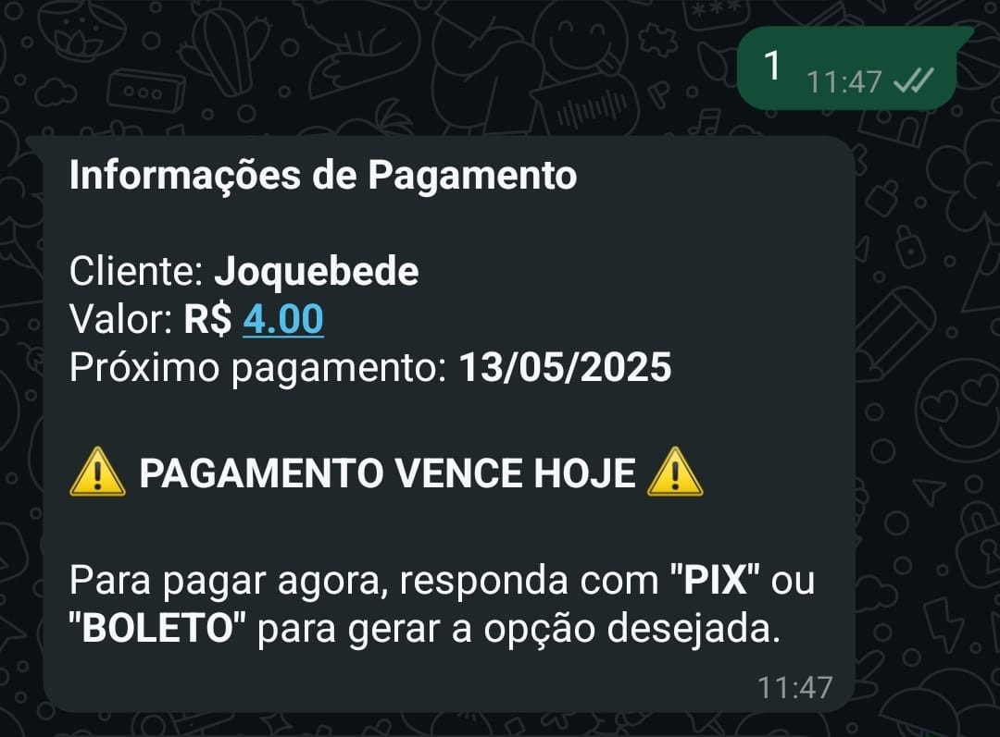
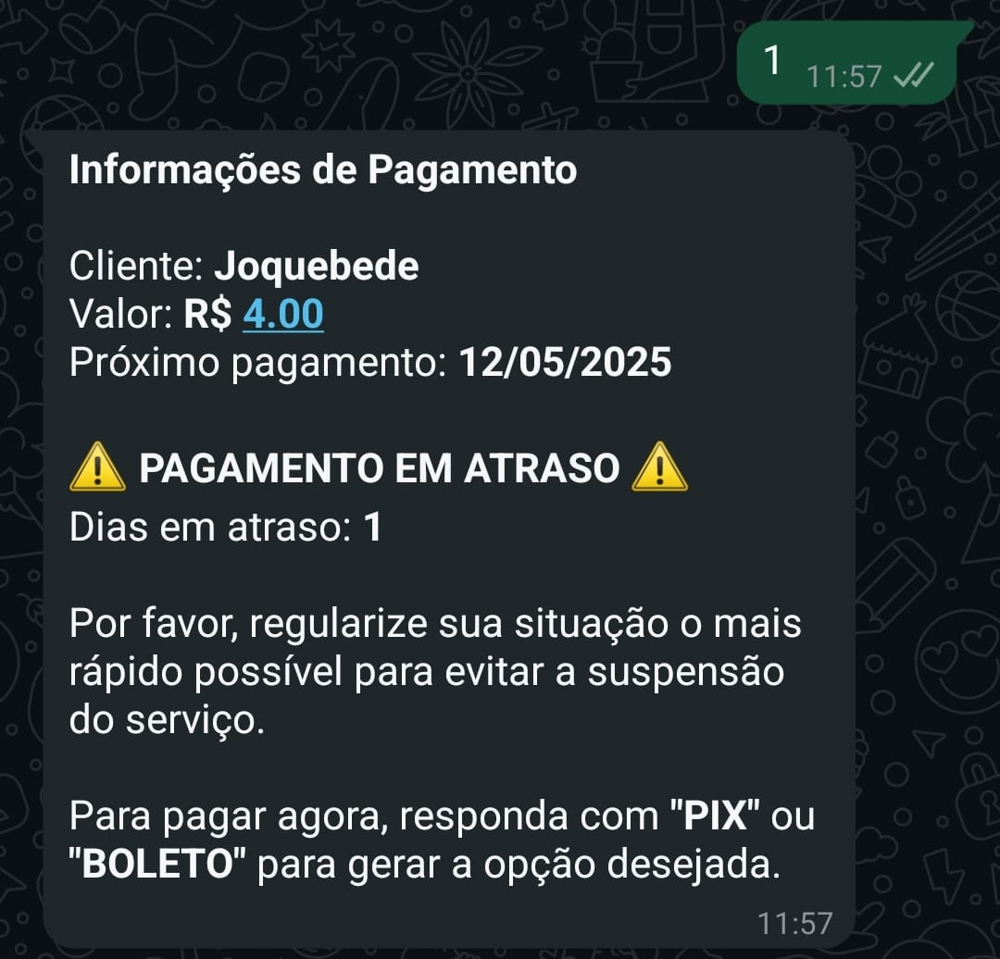
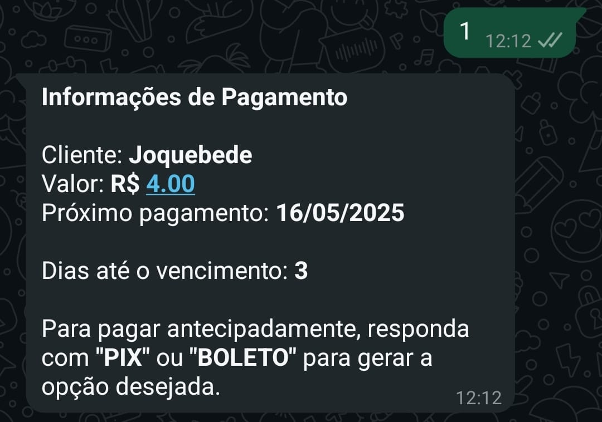
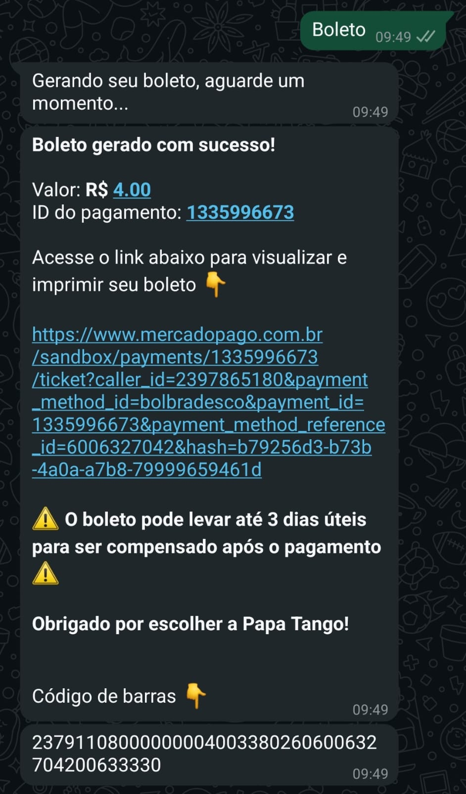
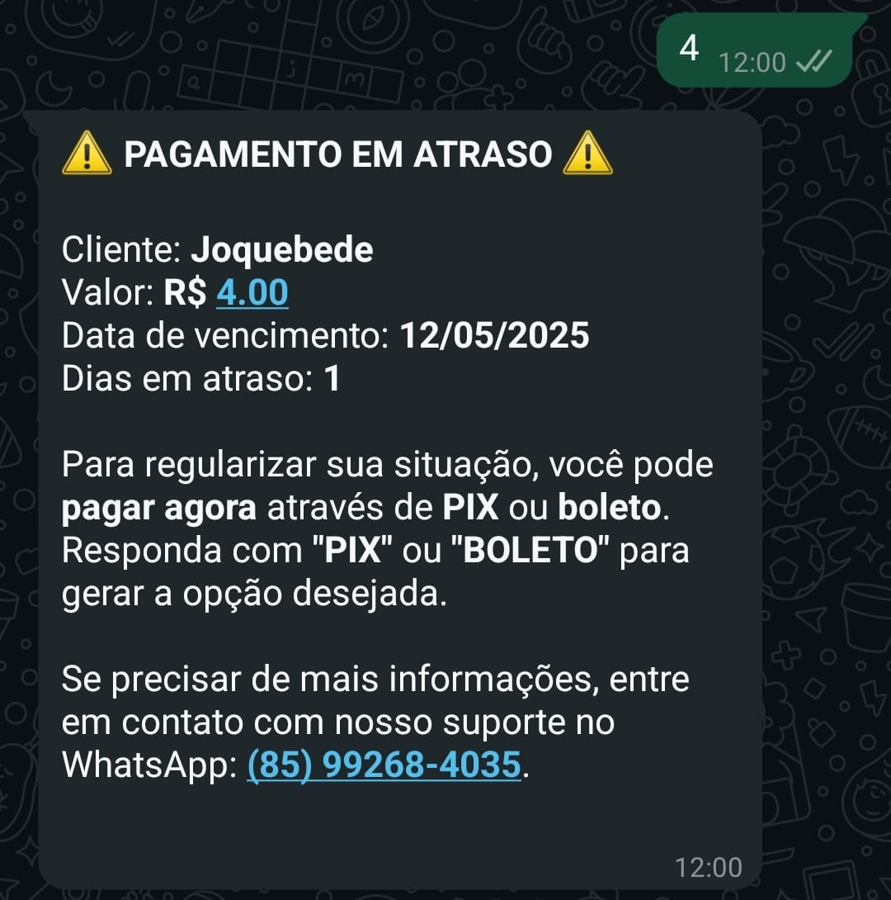
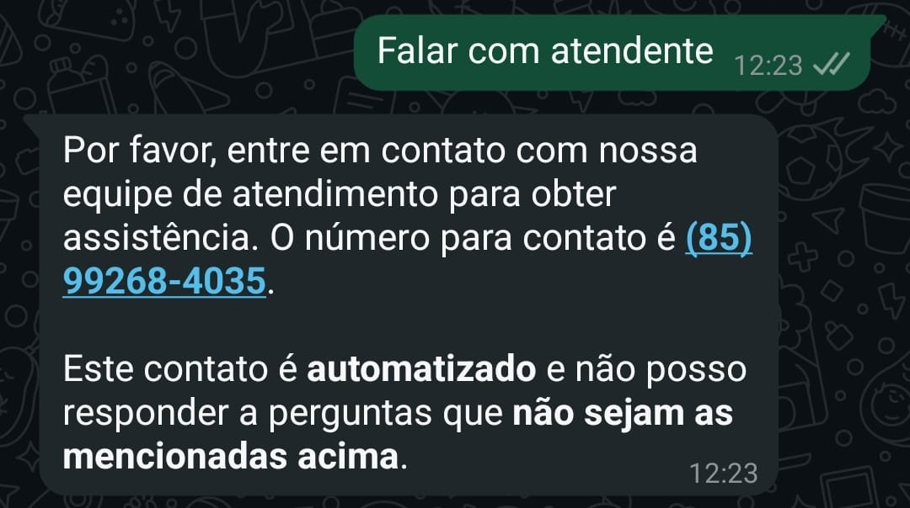
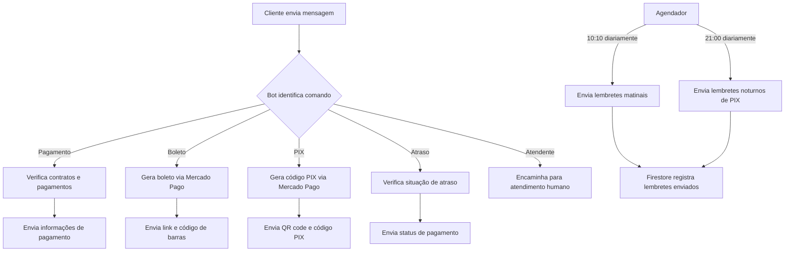

# Papa Tango WhatsApp Bot


Um bot de WhatsApp automatizado para gerenciamento de pagamentos e comunicação com clientes da Papa Tango, uma plataforma de aluguel de motos.

## 📋 Índice
- [Visão Geral](#-visão-geral)
- [Problema Resolvido](#problema-resolvido)
- [Benefícios](#benefícios)
- [Screenshots](#-screenshots)
- [Funcionalidades](#-funcionalidades)
- [Fluxo de Trabalho](#-fluxo-de-trabalho)
- [Sistema de Notificação por Email](#-sistema-de-notificação-por-email)
- [Tecnologias Utilizadas](#️-tecnologias-utilizadas)
- [Instalação e Configuração](#-instalação-e-configuração)
- [Uso do Bot](#-uso-do-bot)
- [Tarefas Agendadas](#️-tarefas-agendadas)
- [Endpoints da API](#-endpoints-da-api)
- [Testes](#-testes)
- [Manutenção](#-manutenção)
- [Solução de Problemas](#-solução-de-problemas)
- [Deploy](#-deploy)
- [Estrutura do Projeto](#-estrutura-do-projeto)
- [Roadmap](#-roadmap)
- [Contato](#-contato)

## 📋 Visão Geral

O Papa Tango WhatsApp Bot é uma solução automatizada para gerenciar pagamentos, enviar lembretes, gerar boletos e códigos PIX, e fornecer informações sobre contratos de aluguel de motos. O bot se integra com o Firebase para armazenamento de dados e com o Mercado Pago para processamento de pagamentos.

### Problema Resolvido

O bot resolve os seguintes desafios enfrentados pela Papa Tango:
- Acompanhamento manual de pagamentos pendentes
- Alta taxa de inadimplência por esquecimento dos clientes
- Dificuldade em gerar métodos de pagamento de forma rápida
- Comunicação inconsistente sobre datas e valores de pagamento

### Benefícios

- **Redução de inadimplência**: Lembretes automáticos aumentam a taxa de pagamentos em dia
- **Economia de tempo**: Automatização de tarefas repetitivas de cobrança
- **Melhor experiência do cliente**: Facilidade para realizar pagamentos via WhatsApp
- **Monitoramento em tempo real**: Acompanhamento de pagamentos e interações
- **Comunicação consistente**: Mensagens padronizadas e profissionais

## 📸 Screenshots

<table>
  <tr>
    <td align="center"><b>Menu Principal</b></td>
    <td align="center"><b>Informações de Pagamento</b></td>
  </tr>
  <tr>
    <td></td>
    <td></td>
  </tr>
  <tr>
    <td align="center"><b>Pagamento Atrasado</b></td>
    <td align="center"><b>Pagamento Adiantado</b></td>
  </tr>
  <tr>
    <td></td>
    <td></td>
  </tr>
</table>

### Geração de Métodos de Pagamento

<table>
  <tr>
    <td align="center"><b>Boleto Normal</b></td>
    <td align="center"><b>Boleto com Atraso</b></td>
    <td align="center"><b>PIX Normal</b></td>
    <td align="center"><b>PIX com Atraso</b></td>
  </tr>
  <tr>
    <td></td>
    <td></td>
    <td></td>
    <td></td>
  </tr>
</table>

### Verificação de Atraso

<table>
  <tr>
    <td align="center"><b>Regular</b></td>
    <td align="center"><b>No Dia do Pagamento</b></td>
    <td align="center"><b>Pagamento Atrasado</b></td>
  </tr>
  <tr>
    <td></td>
    <td></td>
    <td></td>
  </tr>
</table>

### Atendimento

<table>
   <tr> 
      <td align="center"><b>Atendimento</b></td> 
   </tr>
   <tr>
      <td></td>
   </tr>
</table>


### Lembretes de Pagamento

<table>
  <tr>
    <td align="center"><b>No Dia</b></td>
    <td align="center"><b>Atrasado</b></td>
    <td align="center"><b>Adiantado</b></td>
    <td align="center"><b>Noturno</b></td>
  </tr>
  <tr>
    <td></td>
    <td></td>
    <td></td>
    <td></td>
  </tr>
</table>

## ✨ Funcionalidades

- **Atendimento Automatizado**: Responde a mensagens dos clientes com um menu interativo
- **Informações de Pagamento**: Fornece detalhes sobre próximos pagamentos e status de contratos
- **Geração de Boletos**: Cria boletos bancários para pagamentos
- **Geração de Códigos PIX**: Gera QR codes e códigos PIX para pagamentos instantâneos
- **Verificação de Atraso**: Informa sobre pagamentos em atraso e suas consequências
- **Lembretes Automáticos**: 
  - Lembretes diurnos (10:10): Enviados para pagamentos próximos do vencimento, no vencimento e atrasados
  - Lembretes noturnos (21:00): Reforço para pagamentos PIX pendentes gerados durante o dia

## 🔄 Fluxo de Trabalho



## 📧 Sistema de Notificação por Email

O bot inclui um sistema de notificação por email que envia alertas automáticos quando um novo QR code é gerado. Isso facilita a reconexão do bot caso a sessão do WhatsApp seja desconectada.

### Funcionamento

1. Quando um novo QR code é gerado (na inicialização ou após desconexão), o sistema envia automaticamente um email para o administrador
2. O email contém um link direto para a página do QR code
3. O administrador pode clicar no link e escanear o QR code para reconectar o bot

### Configuração

Para que o sistema de notificação funcione, as seguintes variáveis de ambiente devem estar configuradas:

```env
EMAIL_USER=seu-email@gmail.com
EMAIL_PASS=sua-senha-de-app
ADMIN_EMAIL=email-do-administrador@gmail.com
RENDER_EXTERNAL_URL=https://seu-app.onrender.com  # Apenas em produção
```

### Endpoints Relacionados

- `GET /qrcode`: Exibe a página com o QR code para escaneamento
- `GET /qrcode-status`: Retorna o status atual do QR code e da conexão
- `GET /teste-email`: Testa o envio de email de notificação

## 🔄 Conexão Robusta

O sistema implementa mecanismos para manter a conexão do WhatsApp estável:

1. **Monitoramento de Estado**: Verifica periodicamente o estado da conexão
2. **Reconexão Automática**: Tenta reconectar automaticamente em caso de desconexão
3. **Resolução de Conflitos**: Resolve conflitos de sessão automaticamente
4. **Notificação por Email**: Envia email quando é necessário escanear um novo QR code

## 🛠️ Tecnologias Utilizadas

- **Node.js**: Ambiente de execução JavaScript
- **Express**: Framework web para APIs
- **Venom-Bot**: Biblioteca para automação do WhatsApp
- **Firebase/Firestore**: Banco de dados e autenticação
- **Mercado Pago API**: Processamento de pagamentos
- **QRCode**: Geração de QR codes para pagamentos PIX
- **Axios**: Cliente HTTP para requisições
- **Node Schedule**: Agendamento de tarefas
- **Nodemailer**: Envio de emails de notificação

## 🚀 Instalação e Configuração

### Pré-requisitos

- Node.js 14+ instalado
- Conta no Firebase com Firestore configurado
- Conta no Mercado Pago para processamento de pagamentos
- Número de telefone dedicado para o bot do WhatsApp

### Instalação

1. Clone o repositório:
```bash
git clone https://github.com/seu-usuario/papa-tango-whatsapp-bot.git
cd papa-tango-whatsapp-bot
```

2. Instale as dependências:
```bash
npm install
```

3. Configure as variáveis de ambiente:
   - Crie um arquivo `.env` baseado no `.env.example`
   - Adicione as credenciais do Firebase e outras configurações necessárias

4. Adicione o arquivo de credenciais do Firebase:
   - Baixe o arquivo `serviceAccountKey.json` do console do Firebase
   - Coloque-o na raiz do projeto

5. Inicie o servidor:
```bash
npm start
```

6. Escaneie o QR code que aparecerá no console para autenticar o WhatsApp

## 📱 Uso do Bot

### Comandos Disponíveis

Os clientes podem interagir com o bot usando os seguintes comandos:

| Comando | Alternativas | Descrição |
|---------|--------------|-----------|
| **1** | pagamento, informações sobre o pagamento | Receber informações sobre o próximo pagamento |
| **2** | boleto, pagar com boleto | Gerar um boleto bancário para pagamento |
| **3** | pix, pagar com pix | Gerar um código PIX para pagamento |
| **4** | atraso, atrasado, regularizar atraso | Verificar situação de atraso em pagamentos |
| **5** | atendente, atendimento, falar com atendente | Solicitar contato com atendente humano |

### Exemplo de Interação

```
Cliente: Olá, preciso pagar meu aluguel
Bot: Olá, Cliente! Como posso ajudar?
     1. Informações sobre pagamento
     2. Pagar com boleto
     3. Pagar com PIX
     4. Verificar atraso
     5. Falar com atendente

Cliente: 3
Bot: Gerando seu código PIX, aguarde um momento...
     [Envia QR Code e instruções de pagamento]
```

### Fluxo de Pagamento

1. Cliente solicita informações de pagamento ou geração de boleto/PIX
2. Bot verifica contratos ativos e calcula valores e datas
3. Bot gera o método de pagamento solicitado e envia para o cliente
4. Cliente realiza o pagamento

## ⏱️ Tarefas Agendadas

O sistema executa automaticamente as seguintes tarefas:

- **Lembretes de Pagamento Diurno**: Enviados diariamente às 10:10
  - Para pagamentos que vencem hoje
  - Para pagamentos que vencem nos próximos 3 dias
  - Para pagamentos atrasados
  
- **Lembretes de Pagamento Noturno**: Enviados diariamente às 21:00
  - Apenas para pagamentos PIX pendentes gerados durante o dia
  - Reforço para aumentar a conversão de pagamentos

- **Keep-Alive**: A cada 14 minutos para evitar que o serviço adormeça no Render.com

## 🔌 Endpoints da API

### Endpoints Públicos

- `GET /`: Verifica status do servidor
- `POST /enviar-codigo`: Envia código de verificação para um número

### Endpoints Administrativos

- `GET /qrcode`: Exibe QR code para autenticação do WhatsApp
- `GET /qrcode-status`: Verifica o status atual do QR code e da conexão
- `GET /teste-email`: Testa o sistema de notificação por email
- `POST /teste-lembrete-matinal`: Testa o envio de lembretes de pagamento matinal
- `POST /teste-lembrete-noturno`: Testa o envio de lembretes de pagamento noturno
- `POST /teste-mensagem`: Testa o envio de mensagens para um número específico
- `GET /verificar-usuarios`: Verifica usuários pelo número de telefone

## 🧪 Testes

Para testar as funcionalidades do bot sem esperar pelo agendamento, você pode usar os seguintes endpoints:

### Teste de Lembretes Matinais
```bash
curl -X POST http://localhost:3000/teste-lembrete-matinal
```

### Teste de Lembretes Noturnos
```bash
curl -X POST http://localhost:3000/teste-lembrete-noturno
```

### Teste de Envio de Mensagem
```bash
curl -X POST http://localhost:3000/teste-mensagem \
  -H "Content-Type: application/json" \
  -d '{"numero": "5585999999999", "mensagem": "Teste de mensagem"}'
```

## 🔧 Manutenção

### Monitoramento

O sistema registra logs detalhados sobre:
- Conexões do WhatsApp
- Processamento de mensagens
- Geração de pagamentos
- Webhooks recebidos
- Erros e exceções

Os logs são armazenados no console e podem ser integrados com serviços como Papertrail ou Loggly para monitoramento em produção.

### Reinicialização

Se o bot desconectar, você pode:
1. Acessar `/qrcode` para escanear um novo QR code
2. Reiniciar o serviço no painel do Render.com

## 🔍 Solução de Problemas

### Problemas Comuns

1. **QR Code não aparece ou não funciona**
   - Verifique se a pasta `tokens` existe e tem permissões de escrita
   - Apague a pasta `tokens` e reinicie o servidor
   - Certifique-se de que o WhatsApp não está aberto em outro dispositivo
   - Verifique seu email para ver se recebeu uma notificação com o link do QR code

2. **Não recebo emails de notificação do QR code**
   - Verifique se as variáveis de ambiente relacionadas ao email estão configuradas corretamente
   - Confirme se o email não está na pasta de spam
   - Teste o envio de email usando o endpoint `/teste-email`
   - Verifique os logs para identificar erros no envio de email

3. **Erro de Índice no Firestore**
   - Acesse o link fornecido no erro para criar o índice necessário
   - Aguarde alguns minutos para que o índice seja criado

4. **Pagamentos não são processados**
   - Verifique as credenciais do Mercado Pago no arquivo .env
   - Confirme se o webhook do Mercado Pago está configurado corretamente
   - Verifique os logs para identificar erros específicos

5. **Bot não responde às mensagens**
   - Verifique se o serviço está em execução
   - Confirme se a autenticação do WhatsApp está ativa
   - Reinicie o serviço e escaneie o QR code novamente

### Logs de Erro

Para visualizar logs detalhados de erros:

```bash
# No ambiente de desenvolvimento
npm start

# No Render.com
Acesse o painel do Render > Logs
```

## 🚢 Deploy

### Deploy no Render.com

1. Crie uma conta no [Render.com](https://render.com)
2. Conecte seu repositório GitHub
3. Crie um novo Web Service
4. Configure as variáveis de ambiente necessárias:
   ```
   NODE_ENV=production
   PORT=3000
   FIREBASE_PROJECT_ID=seu-projeto-id
   MERCADO_PAGO_ACCESS_TOKEN=seu-token
   ```
5. Configure o comando de build: `npm install`
6. Configure o comando de start: `node src/services/index.js`
7. Defina o plano de hospedagem (o plano gratuito é suficiente para começar)
8. Faça o deploy e acesse a URL fornecida
9. Configure um serviço de monitoramento para evitar inatividade (usando o endpoint keep-alive)

## 📊 Estrutura do Projeto

```
papa-tango-whatsapp-bot/
├── src/
│   ├── config/
│   │   └── firebase.js       # Configuração do Firebase
│   ├── services/
│   │   ├── index.js          # Servidor Express e rotas
│   │   ├── payment.js        # Serviços de pagamento
│   │   ├── scheduler.js      # Agendador de tarefas
│   │   └── whatsapp.js       # Cliente WhatsApp
│   └── utils/
│       └── logger.js         # Utilitário de logging
├── temp/                     # Arquivos temporários (QR codes)
├── tokens/                   # Tokens de sessão do WhatsApp
├── screenshots/              # Screenshots para documentação
├── .env                      # Variáveis de ambiente
├── .env.example              # Exemplo de variáveis de ambiente
├── .gitignore                # Arquivos ignorados pelo Git
├── package.json              # Dependências e scripts
└── README.md                 # Documentação
```

## 🚀 Roadmap

Funcionalidades planejadas para futuras versões:

- [ ] **Integração com CRM**: Sincronização com sistema de gestão de clientes
- [ ] **Análise de sentimento**: Detecção automática de clientes insatisfeitos
- [ ] **Múltiplos números**: Suporte a vários números de WhatsApp para escalabilidade
- [ ] **Chatbot com IA**: Integração com modelos de linguagem para respostas mais naturais
- [ ] **Relatórios automáticos**: Envio de relatórios diários/semanais para gestores

## 📞 Contato

Para suporte ou dúvidas, entre em contato através do WhatsApp: (85) 99268-4035.

Para questões técnicas ou contribuições ao projeto, entre em contato com:
- Pedro Castro - [pedrohenriquecastro.martins@gmail.com](mailto:pedrohenriquecastro.martins@gmail.com)
- [GitHub](https://github.com/pedcastr)
- [LinkedIn](https://www.linkedin.com/in/pedro-castro-2504471b7/)

---

Desenvolvido com ❤️ por Pedro Castro

*Este projeto é proprietário e seu uso é restrito à Papa Tango.*
